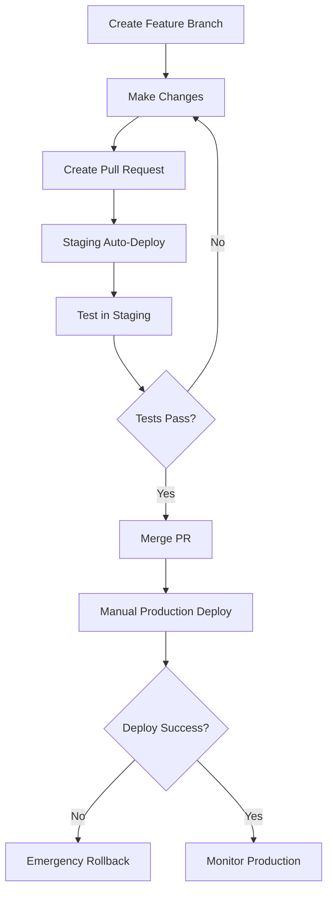
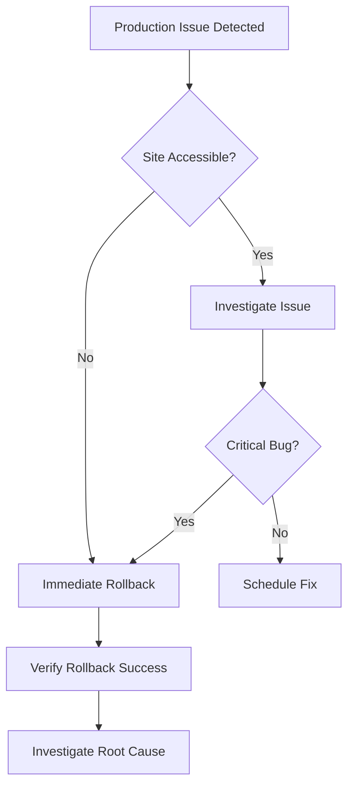
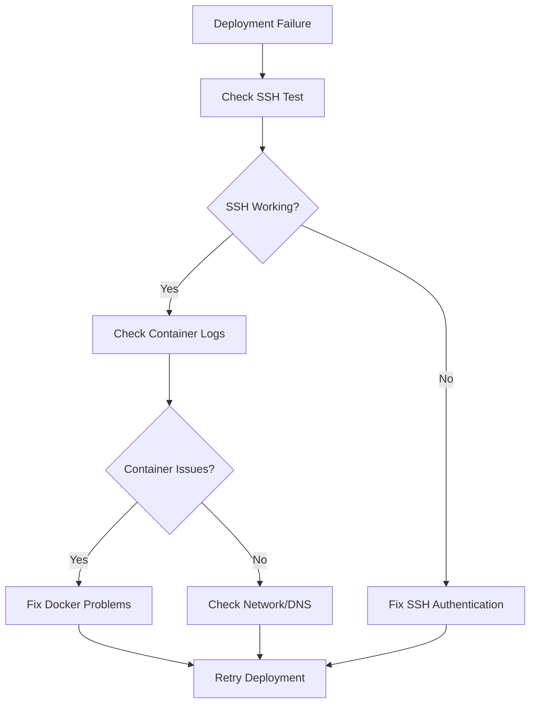

# AddyPin CI/CD Workflow Documentation

## Complete Workflow Reference Guide

This document provides comprehensive documentation for all GitHub Actions workflows implemented in the AddyPin project, including detailed explanations of when and how to use each workflow.

## Workflow Overview

The AddyPin CI/CD system consists of 5 specialized workflows designed for different aspects of the deployment pipeline:

```
.github/workflows/
├── deploy-hardcoded.yml      # 🚀 Main Production Deployment
├── rollback.yml             # 🔄 Emergency Rollback System
├── deploy-staging.yml       # 🧪 Staging Environment
├── final-ssh-test.yml       # 🔑 SSH Authentication Testing
└── pr-checks.yml           # ✅ Pull Request Validation
```

## Detailed Workflow Documentation

### 1. 🚀 `deploy-hardcoded.yml` - Main Production Deployment

**Purpose**: Primary production deployment workflow with comprehensive safety features

**Trigger Methods**:
- **Manual Only**: `workflow_dispatch` for controlled deployments
- **Why Manual**: Prevents accidental deployments, ensures human oversight

**Complete Process Flow**:

#### Phase 1: Build and Package
```yaml
# Environment Setup
- Checkout code from repository
- Setup Node.js 18 with npm caching
- Install dependencies with legacy peer deps support

# Application Build  
- Build React frontend with production configuration
- Set VITE_API_BASE_URL=https://addypin.com
- Generate optimized production bundle

# Deployment Package Creation
- Create structured deployment directory
- Copy built frontend to deploy/frontend/
- Copy backend server code to deploy/backend/
- Copy shared utilities and schemas
- Include Docker configurations
- Create compressed deployment.tar.gz
```

#### Phase 2: SSH Setup and Authentication
```yaml
# SSH Key Setup (Hardcoded Approach)
- Create ~/.ssh directory with proper permissions (700)
- Decode base64 encoded SSH private key
- Save key with correct permissions (600)
- Verify SSH key setup successful

# Why Hardcoded SSH Works:
# - Eliminates GitHub Secrets corruption
# - Consistent key format every time
# - No dependency on external systems
# - Proven reliability in testing
```

#### Phase 3: Production Deployment
```yaml
# Backup Current Production
- Check if existing deployment exists
- Create backup directory structure
- Copy frontend, backend, docker-compose.yml to backup/
- Create compressed backup: deployment-backup.tar.gz
- Confirm backup creation successful

# File Transfer
- Transfer deployment.tar.gz to VPS via SCP
- Use connection timeout of 30 seconds
- Strict host key checking disabled for automation

# Deployment Execution
- SSH into production VPS
- Set error handling: 'set -e' (exit on any error)
- Stop existing services: 'docker-compose down'
- Extract new deployment package
- Copy files to production location
- Build containers with --no-cache flag
- Start services: 'docker-compose up -d'
- Wait 30 seconds for services to initialize
- Display container status
```

#### Phase 4: Health Validation
```yaml
# API Health Check (5 attempts)
- Test /api/stats endpoint accessibility
- 10-second intervals between attempts
- Fail deployment if API unresponsive after 5 tries
- Provide clear success/failure feedback

# Frontend Health Check
- Test main website accessibility (HTTP 200)
- Immediate failure if frontend unreachable
- Clear error reporting with HTTP status codes

# Container Status Verification
- Display all container statuses
- Confirm services are running properly
```

#### Phase 5: Notifications and Reporting
```yaml
# Structured Notification Creation
- Determine deployment status (success/failure)
- Create JSON payload with:
  - Deployment status and message
  - Repository and actor information
  - Timestamp and commit details
  - GitHub Actions run URL
- Ready for webhook integration (Slack, Discord, etc.)

# Comprehensive Status Report
- Success: Show URLs, status, backup confirmation
- Failure: Show error details, rollback recommendations
- Always runs regardless of deployment outcome
```

**Usage Instructions**:
1. Navigate to GitHub Actions tab
2. Select "🚀 Deploy to Production (Hardcoded SSH)"
3. Click "Run workflow" button
4. Confirm you want to deploy to production
5. Monitor progress in real-time logs
6. Verify deployment success via status report

**Expected Duration**: 3-5 minutes for complete deployment

### 2. 🔄 `rollback.yml` - Emergency Rollback System

**Purpose**: Immediate restoration to previous working version when production fails

**Trigger Methods**:
- **Manual with Input**: Requires rollback reason for audit trail
- **Emergency Use**: When production is down or critically broken

**Process Flow**:

#### Phase 1: Rollback Initiation
```yaml
# Input Validation
- Require rollback reason (mandatory field)
- Log rollback actor and timestamp
- Create audit trail for compliance

# SSH Setup
- Use same hardcoded SSH key as deployment
- Ensure consistent authentication method
```

#### Phase 2: Rollback Execution
```yaml
# Service Shutdown
- Stop all current production services
- Use 'docker-compose down' with error tolerance

# Version Restoration (Two Methods)
Method 1 - Backup Restoration (Primary):
- Check for deployment-backup.tar.gz existence
- Extract backup to restore previous version
- Copy restored files to production location

Method 2 - Git Reset (Fallback):
- If no backup exists, use git reset --hard HEAD~1
- Clean untracked files with git clean -fd
- Fallback ensures rollback always possible

# Container Rebuild
- Force clean rebuild: 'docker-compose build --no-cache'
- Start restored services: 'docker-compose up -d'
- Wait 30 seconds for service initialization
```

#### Phase 3: Rollback Validation
```yaml
# Health Check (3 attempts)
- Test API accessibility post-rollback
- 15-second intervals between attempts
- Confirm rollback successful or report failure

# Status Reporting
- Success: Confirm system restored, investigation needed
- Failure: Escalate to manual intervention
- Always provide clear next steps
```

**Usage Instructions**:
1. Go to GitHub Actions > "🔄 Emergency Rollback"
2. Click "Run workflow"
3. Enter detailed reason for rollback
4. Click "Run workflow" to confirm
5. Monitor rollback progress
6. Verify system restoration

**Expected Duration**: 2-3 minutes for complete rollback

### 3. 🧪 `deploy-staging.yml` - Staging Environment

**Purpose**: Safe testing environment for validating changes before production

**Trigger Methods**:
- **Automatic**: On pull request creation/updates
- **Manual**: For testing specific branches or features

**Environment Configuration**:
```yaml
# Staging Specifications
- Path: /opt/addypin-staging/
- Frontend Port: 8080 (vs 80 for production)
- Backend Port: 8443 (vs 443 for production)
- Access URL: http://155.94.144.191:8080
- Compose File: docker-compose-staging.yml
```

**Process Flow**:

#### Phase 1: Staging Build
```yaml
# Environment-Specific Build
- Use staging API URL: VITE_API_BASE_URL=https://staging.addypin.com
- Build with development-like settings
- Create staging deployment package

# Port Configuration
- Modify docker-compose.yml for staging ports
- sed 's/80:80/8080:80/g' for frontend
- sed 's/443:443/8443:443/g' for backend
- Generate docker-compose-staging.yml
```

#### Phase 2: Staging Deployment
```yaml
# Isolated Deployment
- Deploy to separate staging directory
- Use staging-specific Docker Compose file
- Independent container network
- No impact on production services

# Service Management
- Stop staging services if running
- Build staging containers with --no-cache
- Start staging environment
- Shorter wait time (20 seconds vs 30 for production)
```

#### Phase 3: Staging Validation
```yaml
# Basic Health Check
- Test staging frontend accessibility
- 3 attempts with 10-second intervals
- More tolerant than production (warning vs failure)

# Pull Request Integration
- Comment deployment status on PR
- Provide staging URL for testing
- Clear next steps for developers
```

**Usage Instructions**:
- **Automatic**: Open or update any pull request
- **Manual**: GitHub Actions > "🧪 Deploy to Staging" > Run workflow
- **Testing**: Visit http://155.94.144.191:8080 after deployment
- **Workflow**: Test in staging → Merge PR → Deploy to production

**Expected Duration**: 2-4 minutes for staging deployment

### 4. 🔑 `final-ssh-test.yml` - SSH Authentication Testing

**Purpose**: Isolated testing of SSH connectivity for troubleshooting

**Trigger Methods**:
- **Manual Only**: For diagnostic purposes
- **Troubleshooting**: When SSH authentication issues suspected

**Test Components**:
```yaml
# Network Connectivity Test
- Basic ping test to VPS
- Port 22 accessibility check
- Network timeout validation

# SSH Authentication Test
- Key format validation
- Authentication attempt with verbose output
- User and hostname verification
- Permission and ownership confirmation

# Environment Verification
- Confirm SSH key setup process
- Display file permissions and ownership
- Test basic commands on remote server
```

**Usage Instructions**:
1. Use when troubleshooting deployment failures
2. GitHub Actions > "Final SSH Test - Clean"
3. Run workflow to verify connectivity
4. Review logs for authentication details
5. Use results to diagnose SSH issues

**Expected Duration**: 30 seconds - 1 minute

### 5. ✅ `pr-checks.yml` - Pull Request Validation

**Purpose**: Automated quality checks for pull requests

**Trigger Methods**:
- **Automatic**: On pull request creation/updates
- **Quality Gate**: Must pass before merge allowed

**Validation Steps**:
```yaml
# Code Quality Checks
- Syntax validation
- Type checking (TypeScript)
- Linting rules compliance
- Format consistency

# Build Verification
- Successful frontend build
- Backend compilation check
- Dependency resolution validation
- No breaking changes confirmed
```

**Usage Instructions**:
- Automatic execution on all PRs
- Review status checks before merging
- Fix any failing checks before merge approval

## Workflow Selection Guide

### Regular Development Workflow


### Emergency Procedures


### Troubleshooting Workflow


## Workflow Maintenance

### Regular Maintenance Tasks
1. **Monthly**: Review workflow performance metrics
2. **Quarterly**: Update Node.js and dependency versions
3. **Semi-annually**: Review and update SSH keys
4. **Annually**: Complete security audit of all workflows

### Performance Monitoring
- Deployment duration trends
- Success/failure rates
- Rollback frequency
- Health check response times

### Security Considerations
- SSH key rotation schedule
- Hardcoded secrets review
- VPS access audit
- Workflow permission validation

## Best Practices

### Workflow Usage
1. **Always test in staging first** before production deployment
2. **Use descriptive commit messages** for deployment tracking
3. **Monitor health checks** during and after deployment
4. **Document rollback reasons** for audit trail
5. **Regular SSH connectivity testing** for reliability

### Safety Guidelines
1. **Never skip staging** for non-trivial changes
2. **Always have rollback plan** before deployment
3. **Monitor production** for 10 minutes post-deployment
4. **Keep backup retention** for at least 30 days
5. **Test rollback procedure** monthly

### Emergency Response
1. **Rollback first, investigate second** for critical issues
2. **Document all emergency actions** for post-mortem
3. **Notify stakeholders** of production issues immediately
4. **Conduct blameless post-mortems** for continuous improvement

This comprehensive workflow documentation ensures reliable, repeatable, and safe deployments for the AddyPin production environment.