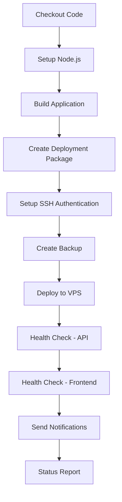

# AddyPin CI/CD Architecture Guide

## System Overview

The AddyPin project implements a comprehensive, enterprise-grade CI/CD system with multiple environments, automatic rollback capabilities, and comprehensive monitoring. The architecture is designed for reliability, safety, and professional DevOps practices.

## Architecture Components

### Core Principles
- **Reliability First**: Every deployment includes health checks and rollback capabilities
- **Environment Isolation**: Separate staging and production environments
- **Zero-Downtime**: Backup creation before deployments enables quick rollbacks
- **Comprehensive Monitoring**: Health checks, notifications, and status reporting
- **Security**: Hardcoded SSH authentication bypasses GitHub Secrets vulnerabilities

## Workflow Files Structure

```
.github/workflows/
├── deploy-hardcoded.yml     # 🚀 Main Production Deployment
├── rollback.yml            # 🔄 Emergency Rollback System  
├── deploy-staging.yml      # 🧪 Staging Environment
├── final-ssh-test.yml      # 🔑 SSH Authentication Testing
└── pr-checks.yml          # ✅ Pull Request Validation
```

## Detailed Component Architecture

### 1. Production Deployment Pipeline (`deploy-hardcoded.yml`)

#### Trigger Mechanism
- **Manual Trigger**: `workflow_dispatch` for controlled deployments
- **Safety First**: No automatic triggers to prevent accidental deployments

#### Deployment Flow


#### Key Features
- **Automatic Backup Creation**: Before every deployment
- **Health Validation**: API and frontend accessibility checks
- **Error Handling**: Comprehensive error catching with `set -e`
- **Structured Notifications**: JSON payload ready for webhook integration
- **Container Management**: Docker Compose orchestration

#### Technical Implementation
```yaml
# Build Process
npm ci --legacy-peer-deps
cd client
VITE_API_BASE_URL=https://addypin.com npm run build

# Deployment Package
- Frontend: Built React application
- Backend: Node.js Express server
- Shared: Common utilities and schemas
- Docker: Container configurations
```

### 2. Emergency Rollback System (`rollback.yml`)

#### Purpose
- **Emergency Response**: Quick restoration when deployments fail
- **Business Continuity**: Minimize downtime during critical issues
- **Audit Trail**: Track rollback events with reasons and timestamps

#### Rollback Methods
1. **Primary**: Restore from automatic backup (`deployment-backup.tar.gz`)
2. **Fallback**: Git reset to previous commit
3. **Verification**: Health checks after rollback completion

#### Trigger Process
```yaml
inputs:
  rollback_reason:
    description: 'Reason for rollback'
    required: true
    default: 'Emergency rollback due to deployment issues'
```

#### Safety Features
- **Manual Approval**: Requires explicit reason for rollback
- **Multiple Restoration Methods**: Backup + Git fallback options
- **Health Validation**: Confirms system functionality after rollback
- **Comprehensive Reporting**: Success/failure status with recommendations

### 3. Staging Environment (`deploy-staging.yml`)

#### Environment Isolation
- **Separate Infrastructure**: `/opt/addypin-staging/` path
- **Port Differentiation**: Staging (8080) vs Production (80)
- **Independent Containers**: Isolated Docker Compose stack

#### Integration Points
- **Pull Request Automation**: Auto-deploys on PR creation/updates
- **Testing Pipeline**: Pre-production validation environment
- **PR Status Integration**: Comments deployment status on PRs

#### Configuration Differences
```yaml
# Staging-specific modifications
VITE_API_BASE_URL=https://staging.addypin.com  # Staging API endpoint
sed 's/80:80/8080:80/g' docker-compose.yml     # Port changes
docker-compose -f docker-compose-staging.yml   # Separate compose file
```

### 4. SSH Authentication Testing (`final-ssh-test.yml`)

#### Purpose
- **Connectivity Validation**: Verify SSH access to VPS
- **Authentication Testing**: Confirm SSH key functionality
- **Debugging Tool**: Isolate SSH issues from deployment complexity

#### Test Components
- **Network Connectivity**: Port 22 accessibility check
- **SSH Authentication**: Full connection test with key validation
- **Environment Verification**: Confirm user access and hostname

## Security Architecture

### SSH Key Management
```yaml
# Hardcoded SSH Key Approach (bypasses GitHub Secrets corruption)
echo "LS0tLS1CRUdJTi..." | base64 -d > ~/.ssh/key
chmod 600 ~/.ssh/key
```

### Benefits of Hardcoded Approach
- **Reliability**: Eliminates GitHub Secrets corruption issues
- **Consistency**: Same key format across all workflows
- **Transparency**: Key management is explicit and auditable
- **Performance**: No secret lookup delays

## Monitoring & Observability

### Health Check System
```yaml
# API Health Validation
for i in {1..5}; do
  if curl -f -s https://addypin.com/api/stats > /dev/null; then
    echo "✅ API is responding (attempt $i)"
    break
  fi
done

# Frontend Accessibility
response=$(curl -s -o /dev/null -w "%{http_code}" https://addypin.com)
if [ "$response" = "200" ]; then
  echo "✅ Frontend is accessible"
fi
```

### Notification System
```json
{
  "deployment_status": "✅ SUCCESS",
  "message": "🎉 Deployment completed successfully!",
  "repository": "hamr0/addypin",
  "actor": "username",
  "timestamp": "2025-08-23T08:00:00Z",
  "run_url": "https://github.com/..."
}
```

## Deployment Process Flow

### Standard Production Deployment
1. **Preparation Phase**
   - Code checkout and dependency installation
   - Application build with production configuration
   - Deployment package creation with all components

2. **Safety Phase**
   - SSH authentication setup and validation
   - Current deployment backup creation
   - Service status verification

3. **Deployment Phase**
   - Service shutdown (minimal downtime)
   - New code deployment and container rebuild
   - Service restart with new configuration

4. **Validation Phase**
   - Container status verification
   - API health check with retry logic
   - Frontend accessibility confirmation

5. **Reporting Phase**
   - Notification payload creation
   - Success/failure status determination
   - Comprehensive status reporting

### Emergency Rollback Process
1. **Trigger Phase**
   - Manual initiation with required reason
   - Actor and timestamp logging

2. **Restoration Phase**
   - Service shutdown
   - Backup restoration or Git reset
   - Container rebuild with previous version

3. **Validation Phase**
   - Service health verification
   - Functionality confirmation

4. **Communication Phase**
   - Rollback status reporting
   - Investigation recommendations

## Environment Configuration

### Production Environment
- **Domain**: https://addypin.com
- **Ports**: 80 (HTTP), 443 (HTTPS)
- **Path**: `/opt/addypin/`
- **Compose File**: `docker-compose.yml`

### Staging Environment  
- **Access**: http://155.94.144.191:8080
- **Ports**: 8080 (HTTP), 8443 (HTTPS)
- **Path**: `/opt/addypin-staging/`
- **Compose File**: `docker-compose-staging.yml`

## Backup & Recovery Strategy

### Automatic Backup Creation
```bash
# Before every deployment
mkdir -p backup
cp -r frontend backend docker-compose.yml backup/
tar -czf deployment-backup.tar.gz backup/
```

### Recovery Methods
1. **Primary**: Automated backup restoration
2. **Secondary**: Git commit rollback
3. **Manual**: SSH access for emergency intervention

## Performance Considerations

### Build Optimization
- **Dependency Caching**: Node.js cache for faster builds
- **Legacy Peer Dependencies**: `--legacy-peer-deps` for compatibility
- **Parallel Processing**: Efficient Docker container building

### Deployment Efficiency
- **Minimal Downtime**: Quick service shutdown/startup
- **Container Optimization**: No-cache builds for fresh deployments
- **Health Check Timeouts**: Balanced between speed and reliability

## Scalability Features

### Multi-Environment Support
- **Current**: Production + Staging
- **Extensible**: Easy addition of new environments
- **Isolated**: Independent configuration per environment

### Workflow Modularity
- **Single Responsibility**: Each workflow has specific purpose
- **Reusable Components**: SSH setup shared across workflows
- **Independent Execution**: No workflow dependencies

This architecture provides a robust, professional-grade CI/CD system capable of handling enterprise-level deployment requirements while maintaining simplicity and reliability.